# About Me

```cpp
string name = "Amir Shahrani";
int age = 21;
string langs[] = {"English", "Malay"};
string university = "Universiti Teknologi PETRONAS";
string major = "Computer Science";
```

<details>
    <summary><h1>My Skills</h1></summary>
    <h2>Operating Systems</h2>
    
    <h2>Languages</h2>
    
    <h2>Frameworks</h2>
    
    <h2>Cloud & Hosting</h2>
    
    <h2>AI & Data</h2>
    
    <h2>Development Tools</h2>
    
    <h2>Design & Content Tools</h2>
    
</details>

<details>
    <summary><h1>My Github Stats</h1></summary>
    <figure>
        
        
    </figure>
</details>
